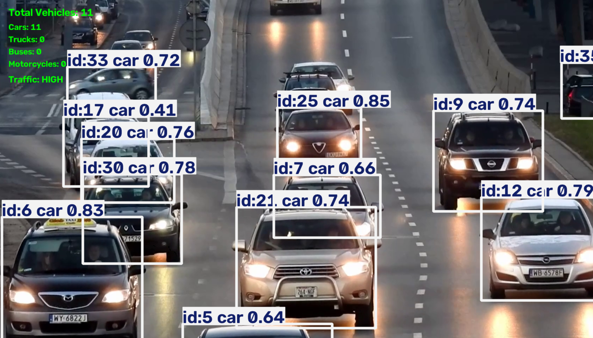

# TrafficVision
Real-time vehicle detection and traffic analytics using Python, OpenCV, and YOLO.
# TrafficVision

TrafficVision is a computer vision project that detects, tracks, and counts vehicles in traffic videos using YOLO and OpenCV.

The system processes video frames, tracks vehicles using persistent IDs, counts vehicles when they cross a predefined line, classifies them by type, and exports the results to a CSV file.

## Features

- Vehicle detection using a pretrained YOLO model
- Multi-object tracking with persistent track IDs
- Vehicle filtering by class and confidence score
- Line-crossing vehicle counting
- Vehicle type statistics
- Traffic status estimation
- CSV export of counted vehicles
- Annotated output video with bounding boxes and statistics

## Technologies Used

- Python
- Ultralytics YOLO
- OpenCV
- Computer Vision
- Object Detection and Multi-Object Tracking

## Project Structure

TrafficVision/
├── images/
├── videos/
├── output/
├── src/
│   ├── config.py
│   ├── utils.py
│   ├── vehicle_detection.py
│   └── video_tracking.py
├── requirements.txt
└── README.md

## How It Works

1. The video is processed frame by frame using OpenCV.
2. A pretrained YOLO model detects and tracks vehicles in each frame.
3. Detected objects are filtered by vehicle class and confidence score.
4. The center point of each detected vehicle is calculated.
5. Persistent track IDs are used to follow vehicles across frames.
6. When a vehicle crosses the predefined counting line, its track ID is checked to prevent duplicate counting.
7. The system updates the total count and vehicle-type statistics.
8. Counted vehicle data is saved to a CSV file.
9. The processed video displays bounding boxes, tracking information, and traffic statistics.

## Installation

1. Clone the repository.

2. Create and activate a virtual environment.

3. Install the required dependencies:

   ```bash
   pip install -r requirements.txt


## Results

TrafficVision generates an annotated output video showing detected and tracked vehicles, their bounding boxes, the counting line, and real-time traffic statistics.

The system also exports information about counted vehicles to a CSV file, including the track ID, vehicle type, and detection confidence.

### Example Output



## Limitations

- Vehicle counting depends on tracking accuracy and camera angle.
- Vehicles are counted only when crossing the predefined line in one direction.
- Traffic status is based on simple count thresholds rather than real-time traffic density.
- Tracking IDs may change when vehicles are heavily occluded.

## Future Improvements

- Connect the system to a live CCTV camera feed.
- Detect parking-space occupancy.
- Identify unauthorized parking events.
- Save parking events and vehicle images to a database.
- Build a simple web dashboard for monitoring parking activity.
- Add real-time notifications for unauthorized parking.